# Introduce
This repository is a clone of the project at https://github.com/CrealityOfficial/K1_Series_Klipper.git

The system uses FYSETC’s CATALYST.K as the main MCU, the Catalyst.K ToolHead (https://github.com/FYSETC/Catalyst.K_Kit) as the toolboard, and Creality’s official K1-MAX-L_V11 module to control leveling.

# Raspberry Pi
## Hardware
Raspberry Pi 5, 4, and 3 are supported.

## Image and Tool
### Image
Ensure you use the Debian 11 image. The system image can be downloaded from: https://downloads.raspberrypi.org/raspios_lite_arm64/images/raspios_lite_arm64-2023-05-03/

### Tool
The Raspberry Pi image creation tool can be downloaded from https://github.com/raspberrypi/rpi-imager/releases?page=3. Once downloaded, proceed with the installation following the provided instructions.

## Image Creation
* **Step 1:** \
Place the SD card into the USB adapter, and then plug the adapter into your computer.

* **Step 2:** \
Start the image burning tool to prepare for writing the system image.
<p align="center">
  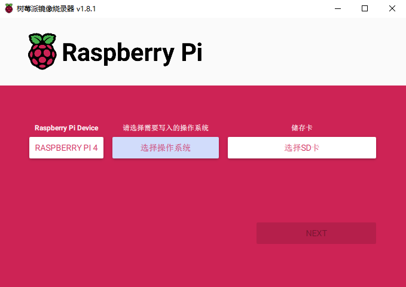
</p>

* **Step 3:** 
<p align="center">
  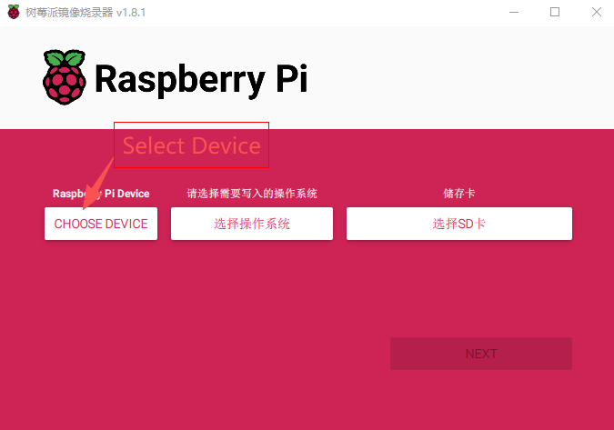
</p>

* **Step 4:** 
<p align="center">
  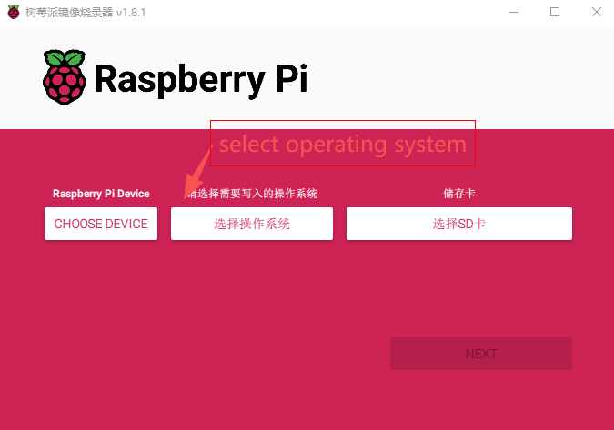
  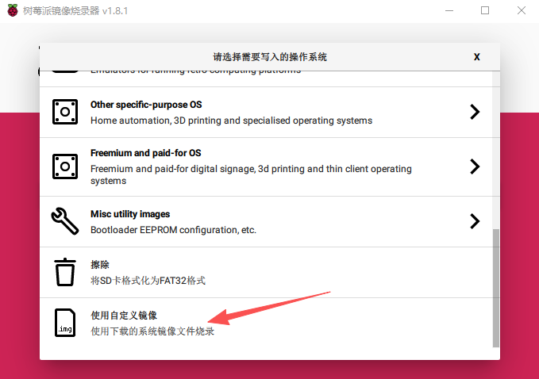
  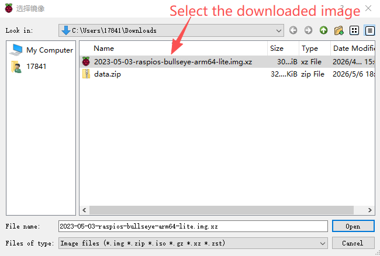
</p>

* **Step 5:** 
<p align="center">
  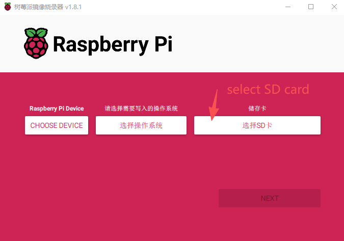
</p>


* **Step 6:** \
Click the Next button, then select Edit Settings.
<p align="center">
  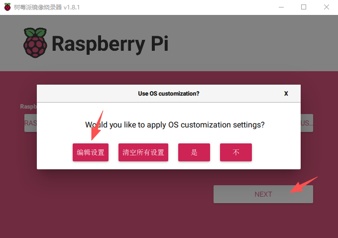
</p>

* **Step 7:** \
Configure the information in the General, Services, and Optional Services tabs, then click Save.
<p align="center">
  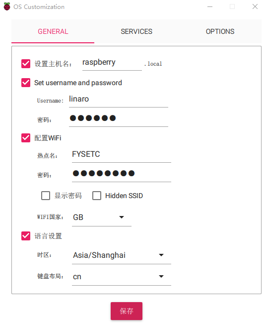
  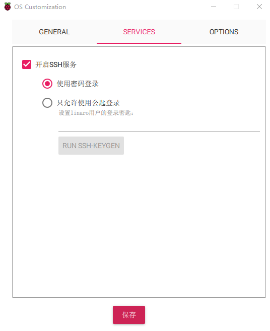
  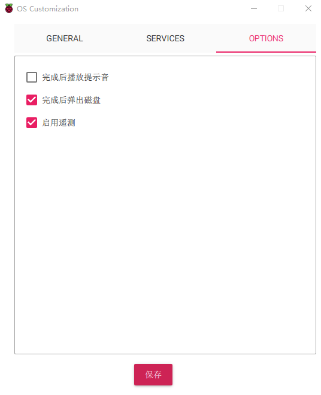
</p>


* **Step 7:** \
Click the YES button.
<p align="center">
  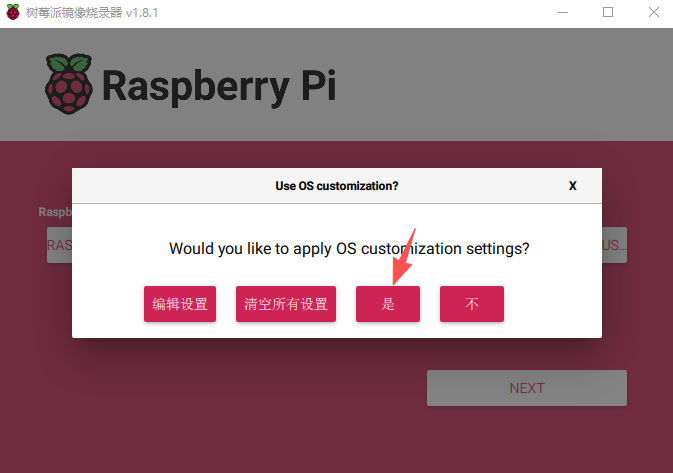
  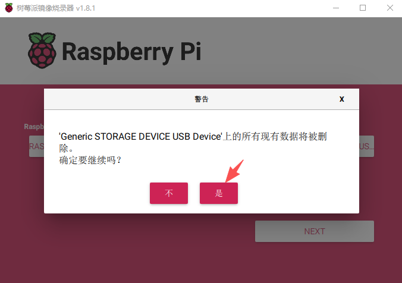
</p>

* **Step 8:** \
Waiting for the image creation to complete…

# Software Install
Use MobaXterm to SSH into your Raspberry Pi, then install any additional software you need.


## Kiauh
* **Step 1:** \
  To download this script, it is necessary to have git installed. If you don't
  have git already installed, or if you are unsure, run the following command:

```shell
sudo apt-get update && sudo apt-get install git -y
```

* **Step 2:** \
  Once git is installed, use the following command to download KIAUH into your home directory:

```shell
cd ~ && git clone https://github.com/dw-0/kiauh.git
```

## Klipper
* **Step 1:** \
Use the following command to download K1_Series_Klipper to your home directory:
```shell
cd ~ && git clone https://github.com/bean22-dev/K1_Series_Klipper.git
```

* **Step 2:** \
Use the following command to install klipper automatically.
```shell
cd ~/K1_Series_Klipper/env && sed -i 's/\r$//' ~/K1_Series_Klipper/env/install.sh && chmod +x install.sh && sudo sh install.sh
```

## Moonrake，Mainsail，KlipperScreen，Crowsnest
* **Step 1:** \
Start kiauh
```shell
cd ~ && ./kiauh/kiauh.sh
```

* **Step 2:** \
After entering the installation menu, select the application you wish to install.

<p align="center">
  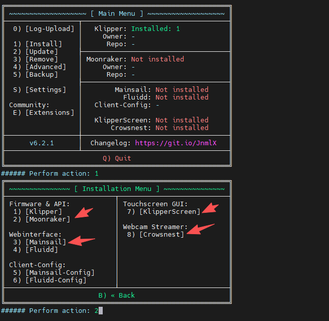
</p>


# MCU fireware
## Catalyst.K
### config with no bootloader
Run the firmware configuration tool using the following command.
```shell
cd ~/K1_Series_Klipper && make menuconfig
```
<p align="center">
  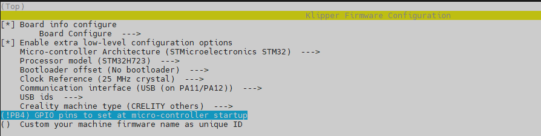
  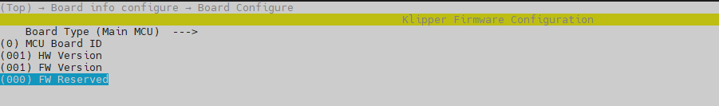
  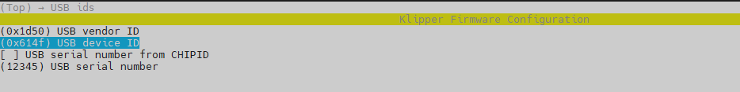
</p>

  ### dfu mode
Before flashing the firmware, you must complete the following five steps to put the MCU into DFU mode.
1. press and hold BOOT0
2. press the RESET button for one second
3. release RESET
4. wait for 3 seconds
5. release BOOT0

  ### flash fireware
  Execute the following command to flash the MCU firmware.
```shell
cd ~/K1_Series_Klipper && make flash FLASH_DEVICE=0483:df11
```
you will see "File downloaded successfully".

## Catalyst.K ToolHead
  ### config with no bootloader
Run the firmware configuration tool using the following command.
```shell
cd ~/K1_Series_Klipper && make menuconfig
```
<p align="center">
  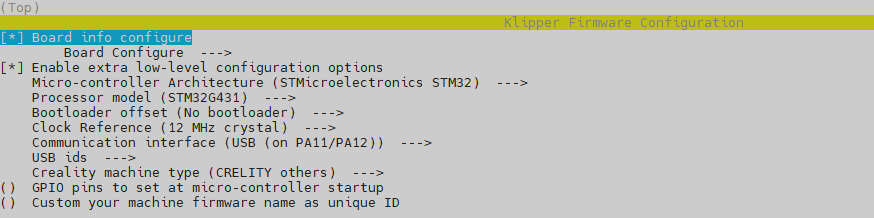
  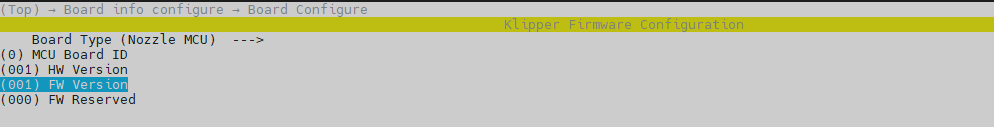
  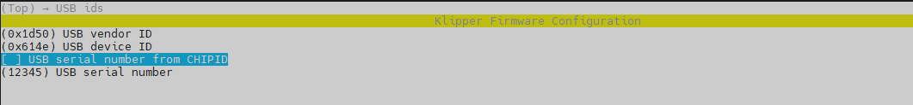
</p>

  ### dfu mode
Before flashing the firmware, you must complete the following five steps to put the MCU into DFU mode.
1. press and hold BOOT0
2. press the RESET button for one second
3. release RESET
4. wait for 3 seconds
5. release BOOT0

  ### flash fireware
Execute the following command to flash the MCU firmware.
```shell
cd ~/K1_Series_Klipper && make flash FLASH_DEVICE=0483:df11
```
you will see "File downloaded successfully".

## leveling_mcu
  SERIAL mode is the only supported mode.
  ### config with bootloader
```shell
cd ~/K1_Series_Klipper && make menuconfig
```
<p align="center">
  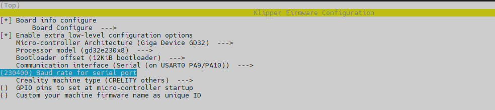
  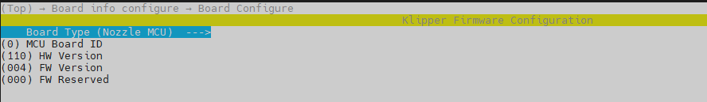
</p>
After saving the configuration, execute the `make` command to compile the firmware.

  ### bootloader mode
  Unplug and reconnect the power terminal.
  <p align="center">
  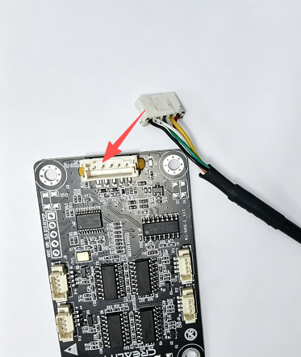
</p>

  ### flash fireware
Execute the following command within 15 seconds of the leveling MCU powering back on.
```shell
systemctl stop klipper && sleep 1 && cd ~/K1_Series_Klipper/env && python3 mcu_util.py -c -i /dev/serial/by-id/usb-wch.cn_USB_Dual_Serial_0123456789-if02 -u -f ~/K1_Series_Klipper/out/klipper.bin -v && systemctl start klipper
```

The original version of mcu_util.py comes from https://github.com/cryoz/k1_mcu_flasher/blob/master/mcu_util.py.

## Contact
The Discord server address is https://discord.gg/bGFE4aaXZ